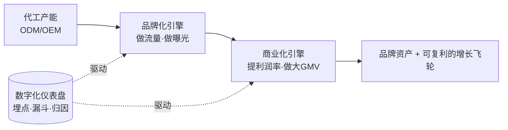
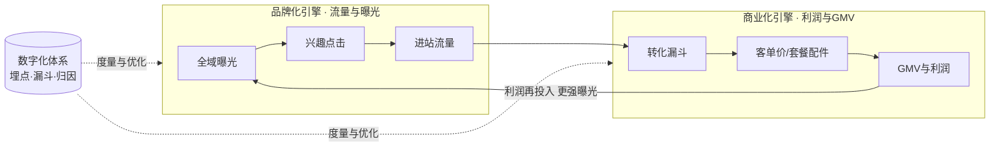
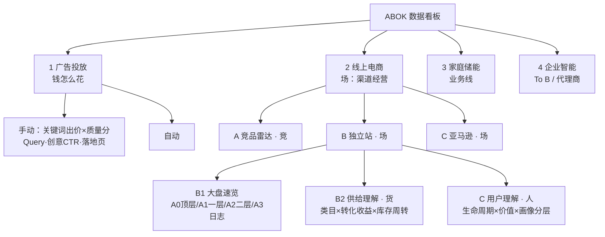
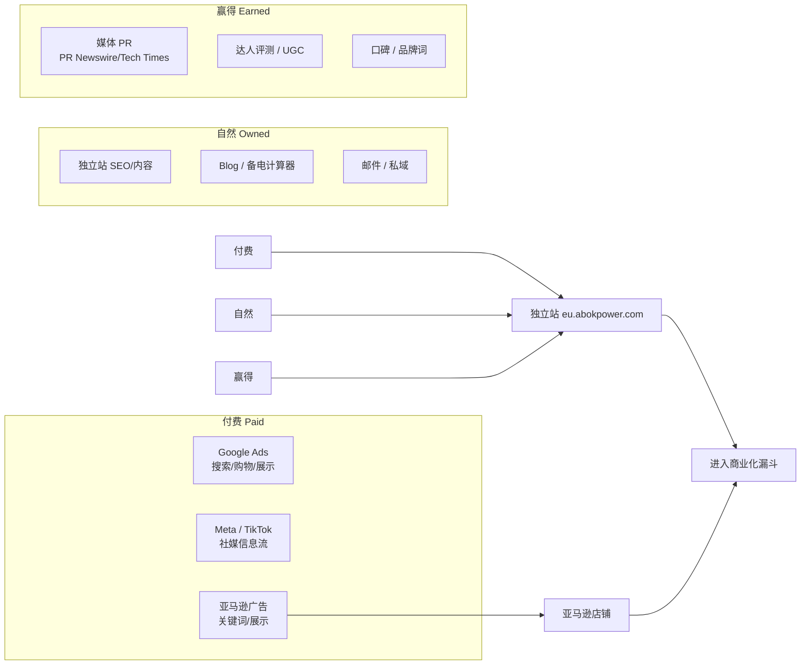
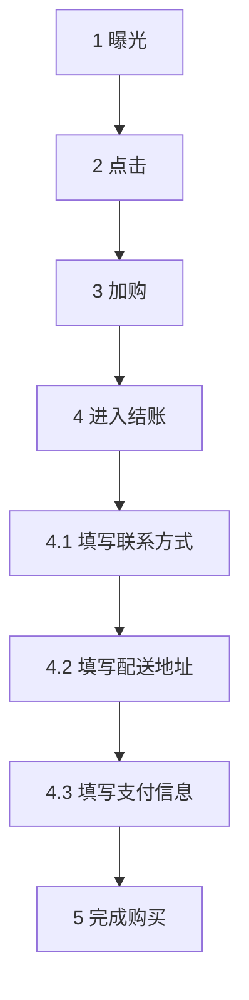
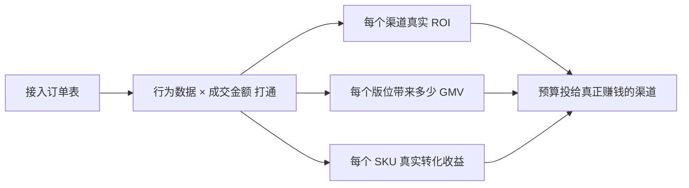
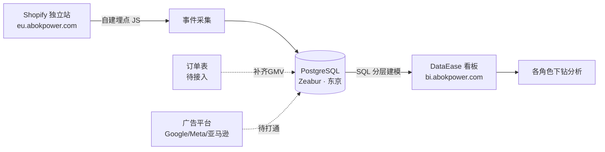
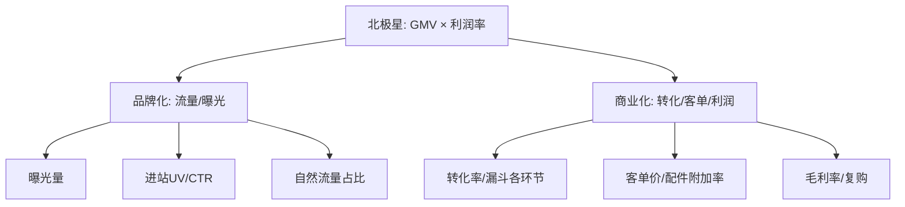
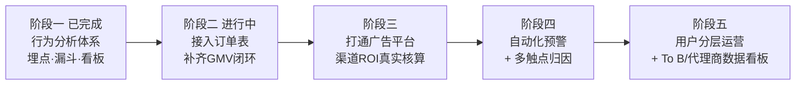

# 营销数字化：ABOK 线上品牌化与商业化路径

> 内部分享交流文档 · v1.0
> 主题：以数据驱动，把 ABOK 从「代工产能」变成「品牌资产」，从「有流量」变成「有利润」。
> 受众：管理层 + 执行团队（市场 / 运营 / 商务 / 产品 / 数据）。
> 阅读方式：**赶时间只读「执行摘要」+ 每部分首段**；要落地看第三、五部分；要体系看第四部分。
> 数据说明：本文表格中的具体数值除特别注明外均为**（示意）**，用于讲清方法与口径，真实数字以 BI 看板 [bi.abokpower.com](https://bi.abokpower.com) 为准。

---

## 0. 执行摘要（一页读懂）

**一句话**：营销数字化，就是给 ABOK 的自有品牌转型装上「两个引擎 + 一套仪表盘」。

- **两个引擎**
  - 🚀 **品牌化引擎 = 做流量、做曝光** —— 让更多对的人看见 ABOK、记住 ABOK、点进来。
  - 💰 **商业化引擎 = 提利润率、做大 GMV** —— 让进来的人更多地买、买得更多、买得更值（利润）。
- **一套仪表盘** —— 已落地的自建埋点分析体系：Shopify 埋点 → PostgreSQL → DataEase 看板（[bi.abokpower.com](https://bi.abokpower.com)），已覆盖**全链路行为、用户动线、8 级转化漏斗、全域归因**。

**为什么现在必须做（三重驱动）**

| 层面 | 过去的状态 | 数字化要解决的 |
| --- | --- | --- |
| **战略** | 以 ODM/OEM 代工为主，品牌沉淀在别人身上 | 转型自有品牌，同时打通**海外代理商（To B）+ 线上零售（To C）**两条线，需要数据底座支撑 |
| **运营** | 投放没归因、市场与运营各执一词；产品设计缺用户/竞品数据，新品测试成本高、周期长 | 用统一口径把「钱花得值不值、产品该做什么」变成可量化的事实 |
| **组织** | 数据阻塞、信息流转不畅，多数岗位没有可量化目标 | 让每个岗位都有「数据抓手」，把主观争论变成客观复盘，形成驱动力 |

**增长路径（本文主线）**



**接下来 90 天最关键的一步**：接入**订单表**，补齐当前看板里 `order_pv / gmv` 的占位字段——只有把「行为」和「成交金额」打通，渠道 ROI 和商业化才算真正闭环。

---

## 第一部分：为什么做营销数字化（共识层）

> 给谁看：所有人。看什么：为什么这件事值得全公司投入，而且是现在。

### 1.1 ABOK 是谁，机会在哪

ABOK 是一个专注**便携储能 / 户外电源**的全球品牌，Slogan **"Power Beyond Limits"**，主打超高能量密度、稳定性与极速充电。

- **产品线（Ark 系列）**：Ark2000（2000W / 1536Wh）、Ark2500（2500W / 2160Wh，新品）、Ark3600（3600W / 3840Wh，支持模块化扩容至 **11,520Wh**，最快 **1.3 小时**充满），配套太阳能板（200W/400W）、扩展电池、阳台光伏系统；三防新品 Ark7200 Plus 将于 **CES 2026** 首秀。
- **市场与场景**：以**欧洲**为主（EUR 定价），覆盖 100+ 国家；核心场景 **家庭备电 / 户外施工 / 露营 / 房车 / 应急断电**。
- **家底**：11 年研发积累、12,000㎡ 工厂、2M+ 用户。

**机会判断**：欧洲能源焦虑（电价、断电、光储自用）持续，储能是**高客单、强决策、重信任**的品类。这既意味着「品牌溢价空间大」，也意味着「决策链长、必须用数据经营用户旅程」——恰恰是数字化的用武之地。

### 1.2 为什么必须做数字化：三重驱动

这不是「为了赶时髦上工具」，而是三个真实压力的交汇点。

**驱动一 · 战略转型：从「做产品」到「做品牌」**

过去以 ODM/OEM 代工为主，规模靠订单、利润靠成本，**品牌资产沉淀在客户那里，不在我们手上**。现在要做两件事：

- 打**自有品牌 ABOK**，让终端用户记住我们，而不是记住某个平台链接；
- 同步开拓两条业务线——**海外代理商渠道（To B）** 与 **线上零售（To C）**。

两条线都需要数据支撑：To B 要用「品牌声量 + 终端动销数据」说服代理商进货；To C 要用「行为 + 转化 + 归因数据」经营每一分流量。**没有数字化，转型就是凭感觉在赌。**

**驱动二 · 运营痛点：把「各执一词」变成「一份事实」**

| 痛点 | 具体表现 | 数字化后的样子 |
| --- | --- | --- |
| **投放没归因** | 市场说「曝光涨了」，运营说「没转化」，谁也说不清预算花得值不值 | 用 `source_code` 归因把每个渠道的「带量 → 承接 → 转化」拉成一条链，用 ROI 说话 |
| **产品缺数据** | 新品该做什么容量、主推什么场景，靠经验拍板；测试成本高、反馈周期长 | 用真实的场景/商品/套餐行为数据反哺选品与定价，先测后投 |
| **决策周期长** | 一个结论要等人工拉数、对表、开会 | 看板实时下钻，趋势与环比自动呈现 |

**驱动三 · 组织效能：给每个岗位一个「数据抓手」**

整体业务此前**数据阻塞、信息流转不顺畅**，大部分岗位缺少可量化的目标，团队做事缺抓手、缺驱动力。数字化的组织价值在于：

- 把公司目标（GMV / 利润）**逐层拆成岗位可执行的指标**（见 4.3 OKR 指标树）；
- 让复盘从「谁嗓门大」变成「看同一个数」；
- 让每个人都能回答「我这周做的事，让哪个数变好了」。

### 1.3 出海独立站的三大命题

做独立站品牌零售，绕不开三道坎，每一道都要靠数字化来接：

1. **流量越来越贵** —— 必须知道每个渠道的真实性价比，把钱投给「带来会买的人」的渠道，而非「只带来看客」的渠道。
2. **决策链长（高客单储能）** —— 用户从「看见」到「下单」要反复比较、跨设备跨天，必须用**用户动线 + 全漏斗**看清他们卡在哪。
3. **归因难** —— 一次成交往往经过多个触点（广告→PR→自然搜索→独立站），必须建**归因模型**才能公平地给各渠道记功。

### 1.4 双引擎：品牌化 ↔ 商业化

这是全文的主线，也是老大定的调子：

- **品牌化 = 做流量、做曝光**：解决「有没有人来、来的是不是对的人」。对应漏斗的**上层**（曝光→点击）和**来源结构**。
- **商业化 = 提利润率、做大 GMV**：解决「来了之后买不买、买多少、赚不赚」。对应漏斗的**下层**（加购→结账→购买）、**客单价**与**毛利结构**。

两者不是先后关系，而是**同一个飞轮的两半**：



### 1.5 数字化的角色：把两个引擎连成「数据飞轮」

没有数字化，品牌化和商业化是**两个各干各的部门**；有了数字化，它们变成**一个自我加速的飞轮**：

> 更精准的曝光 → 更高质量的流量 → 更高的转化与客单 → 更多利润 → 更多预算投入更精准的曝光……

数字化体系就是这个飞轮的**轴承和仪表盘**：既减少摩擦（信息不通、口径不一），又持续告诉你「哪半个引擎该加力」。

而这个仪表盘不是空想——它已经建成，就是 [bi.abokpower.com](https://bi.abokpower.com) 上的看板体系。它的顶层结构本身就是一张「人-货-场-竞」经营地图（详见第四部分）：



> 说明：该看板规划仍在演进中，本文引用的模块名以当前版本为准，后续如调整以看板实际为准。

---

## 第二部分：品牌化路径——做流量、做曝光

> 给谁看：市场 / 内容 / 投放 + 管理层。看什么：怎么让「对的人」看见 ABOK，以及怎么衡量这件事做得好不好。

### 2.1 品牌化不是「刷曝光」，是经营认知漏斗

「做曝光」如果只看曝光量，很容易自嗨。品牌化真正的目标是把人从**陌生**一步步带到**心智占领**：

| 阶段 | 用户状态 | 衡量信号 | 对应看板 |
| --- | --- | --- | --- |
| **认知 Awareness** | 第一次看到 ABOK | 曝光量、触达人数、展示份额 | 广告投放 / 大盘速览 A0 |
| **兴趣 Interest** | 点进来看了 | 点击、CTR、落地页停留、进站 UV | 广告投放·Query（落地页）/ A1 一层下钻 |
| **考虑 Consideration** | 反复看、比较 | 复访、多页浏览、加入愿望单/加购 | A2 二层下钻 / 用户理解 |
| **心智 Mind-share** | 主动找 ABOK | **品牌词搜索量**、直接访问占比、复购 | 用户理解·生命周期 |

> **关键认知**：品牌化的终点不是「花钱买来的流量」，而是**不花钱也会来的流量**（品牌词、直接访问、复购）。这个比例上升，才说明品牌真的立起来了。

### 2.2 全域流量矩阵：ABOK 的「曝光在哪里发生」

ABOK 是**多渠道品牌**（独立站 + 亚马逊 + 媒体 + 社媒），品牌化要把这些渠道当成一个整体来经营，而不是各算各的账。



**渠道分工建议（示意）**

| 渠道 | 品牌化角色 | 主看什么 |
| --- | --- | --- |
| **Google 搜索/购物** | 承接高意向需求（"portable power station"、竞品词） | 展示份额、CTR、进站质量 |
| **Meta / TikTok** | 场景种草、拉新认知（露营/家庭备电内容） | 曝光、互动率、进站成本 |
| **媒体 PR / 达人** | 建立信任背书（CES 2026、评测） | 触达量、引用/回链、品牌词提升 |
| **独立站内容/SEO** | 沉淀自然流量、承接长决策 | 自然流量占比、关键词排名 |
| **亚马逊** | 成交主阵地 + 反哺品牌搜索 | 竞品雷达对比、Query 表现 |

### 2.3 曝光的可衡量：版块级埋点 + 位置价值

**这是 ABOK 数字化已经落地、且很有辨识度的一块能力**：独立站不是只统计「首页 PV」，而是把首页拆成**一个个版位**逐块埋点，每个版位的曝光、点击、位置都可量化。

真实埋点已覆盖的首页版位（`slot_type`）：

| 版位 | 埋点标识 | 品牌化用途 |
| --- | --- | --- |
| 主 Banner | `banner-*` | 首屏主推信息的吸引力 |
| 使用场景 | `usagescenarios-*` | 哪个场景（家庭/露营/RV）最能打动人 |
| 爆品位 | `productbestsellers-*` | 哪些产品自带流量 |
| 顶部导航 | `headernav-*` | 用户想找什么 |
| 首页分类 | `homecategory-*` | 品类兴趣分布 |
| 了解更多 | `learnmore-*` | 内容/教育需求 |

而且每个版位带 **`slot_rank`（位置排序）**，可以回答一个很实际的问题：**「首屏 vs 第三屏，同一个内容值多少曝光和点击？」**——这直接指导首页版位怎么排、把最能带量的内容放到最值钱的位置。

**版位效果表（示意）**

| 版位 | 位置 | 曝光 | 点击 | CTR | 判断 |
| --- | --- | --- | --- | --- | --- |
| banner-ark3600 | 首屏#1 | 48,200 | 3,120 | 6.5% | ✅ 强，保留 |
| usagescenarios-home | 第2屏 | 31,500 | 1,260 | 4.0% | ⚠️ 内容可优化 |
| bestsellers-ark2000 | 第3屏 | 22,800 | 410 | 1.8% | ❗位置偏低，考虑上移 |

### 2.4 来源归因：分清「谁带来了流量、带来的流量值不值」

品牌化最容易翻车的地方是——**只看「带来多少量」，不看「带来的量质量如何」**。ABOK 埋点用 `source_code` 对每个来源打标，让每个渠道不仅比「量」，还比「承接质量」。

**来源质量对比（示意）**

| 来源 source_code | 进站 UV | 点击率 | 加购率 | 判断 |
| --- | --- | --- | --- | --- |
| google_shopping | 12,400 | 38% | 9.2% | ✅ 高质高量，加投 |
| tiktok_feed | 18,900 | 22% | 2.1% | ⚠️ 量大但浅，优化落地页 |
| pr_technews | 3,200 | 41% | 7.8% | ✅ 质优，值得持续做 PR |
| amazon_referral | 5,600 | 30% | 6.5% | ✅ 跨渠道协同有效 |

> **配合「广告投放·Query」看板**：把「关键词/Query → 商品相关性 → 创意 CTR → 落地页承接」拉成一条链，就能定位「是词不对、图不行、还是落地页掉链子」，让投放优化有的放矢。**配合「竞品雷达」看板**：把自己的曝光/价格/评价放到竞争坐标里看，避免自嗨。

### 2.5 品牌化 KPI 体系

**给管理层的一句话**：品牌化做得好不好，看这一组数就够了。

| 维度 | 核心指标 | 健康信号 |
| --- | --- | --- |
| **量** | 总曝光、进站 UV、新访客数 | 稳定增长 |
| **质** | CTR、加购率（按来源）、跳出率 | 高质渠道占比上升 |
| **结构** | 各来源流量占比、付费/自然比例 | **自然 + 品牌词占比上升** |
| **心智** | 品牌词搜索量、直接访问占比、复访率 | 持续上升（品牌真正立起来的信号） |
| **效率** | 单次进站成本、单次加购成本 | 下降或稳定 |

> **品牌化的终极 KPI**：不是「今天曝光了多少」，而是「**不花钱也来的人**占比是不是在涨」。这条线上升，商业化引擎的燃料成本才会持续下降。

---

## 第三部分：商业化路径——提利润率、做大 GMV

> 给谁看：运营 / 商务 + 管理层。看什么：流量进来之后，怎么让更多人买、买更多、买得更有利润。

### 3.1 一个公式看懂商业化

商业化不是一件事，是四个可以分别优化的因子：

```
GMV = 流量 × 转化率 × 客单价(AOV) × 复购
利润 = GMV × 毛利率 − 履约/退款/获客成本
```

- **流量** ← 由品牌化引擎供给（第二部分）。
- **转化率** ← 靠全漏斗优化（3.2）。
- **客单价** ← 靠套餐 + 配件的「客单价工程」（3.3）。
- **复购 & 毛利** ← 靠用户经营与结构优化（3.4）。

**数字化的价值**：把这个公式的每一项都变成**看得见、可归因、可改进**的数字，而不是一个笼统的「销售额」。ABOK 独立站的「大盘速览 A0-A3」下钻结构，正是为拆解这个公式而生。

### 3.2 全漏斗转化：8 级漏斗，精确定位「钱漏在哪」

这是 ABOK 数字化最硬核的一块能力：不是只看「有多少人下单」，而是把从曝光到成交切成 **8 级漏斗**，逐级看流失。真实漏斗（`stage_order` 定义）：



**漏斗诊断（示意）**

| 阶段 | 到达人数 | 环节转化 | 诊断 |
| --- | --- | --- | --- |
| 1 曝光 | 100,000 | — | |
| 2 点击 | 8,000 | 8.0% | 品牌化/创意问题 → 回第二部分 |
| 3 加购 | 2,400 | 30% | 商详页说服力 |
| 4 进入结账 | 1,200 | 50% | ✅ 意向强 |
| 4.1 联系方式 | 1,050 | 88% | |
| 4.2 配送地址 | 900 | 86% | |
| 4.3 支付信息 | 640 | 71% | ❗**支付环节流失大** |
| 5 完成购买 | 540 | 84% | |

> **这张图的威力**：过去「转化率低」是一句无法行动的抱怨；现在能精确到「**4.3 支付环节掉了 29%**」，于是行动很具体——查支付方式是否齐全（PayPal/信用卡/Google Pay/本地支付）、是否有隐藏运费、是否需要强制注册。**结账环节每救回 5%，就是纯利润。**
>
> 埋点上还特意区分了负向/中性动作（`click_remove` 移除、`click_plus/minus` 改数量），不把它们算进正向漏斗，保证口径干净。

**弃单挽回**：漏斗里「加购/进结账但没买」的人是**最值钱的再营销人群**——他们已经表达了强意向。对这批人做邮件/再营销广告，ROI 通常远高于拉新。数字化让我们能**精确圈出这批人**。

### 3.3 客单价工程：套餐 + 配件，把「一次成交」做厚

储能品类天然适合做客单价——因为它是**一套系统**（主机 + 扩展电池 + 太阳能板），不是单品。ABOK 埋点已经把商品维度拆成三类，专门支撑这件事：

| 商品类型 | 埋点标识 | 商业化意义 |
| --- | --- | --- |
| **单品** `variant_single` | 纯数字 id | 基础盘 |
| **套餐包** `variant_combo` | `id_id_id` | 一次多卖，**拉高客单** |
| **配件** | `accessory_variant_ids` | 太阳能板/扩展电池，**高毛利附加** |

ABOK 产品本身就给了绝佳的组合空间：

- **Ark2000 + Ark2000E**（扩展电池）→ 1536Wh 升到 3072Wh
- **Ark3600 + Ark3600E** → 一路扩到 7680Wh，最高 11,520Wh
- **任意主机 + 太阳能板** → 完整光储方案（对应官网「阳台光伏系统」）

**客单价拆解（示意）**

| 组合 | 占比 | 客单价 | 毛利率 | 策略 |
| --- | --- | --- | --- | --- |
| 仅主机 | 55% | €569 | 中 | 引导加配件 |
| 主机 + 扩展电池 | 25% | €899 | 中高 | ✅ 主推套餐 |
| 主机 + 太阳能板 | 15% | €799 | **高** | ✅ 高毛利，重点推 |
| 全套系统 | 5% | €1,400+ | 高 | 高客单标杆 |

> **配件附加率**是商业化的关键杠杆：同样的流量和转化，配件附加率从 20% 提到 35%，客单价和利润会明显抬升，且**几乎不增加获客成本**。「B2 供给理解：商品类目×转化收益×库存周转」看板正是为看清「哪些货最赚钱、哪些压库存」而建。

### 3.4 利润率视角：不是卖得多，是赚得多

做大 GMV 如果以牺牲利润为代价，就是虚胖。数字化要让「利润」和「GMV」一样透明：

| 抓手 | 怎么做 | 数据支撑 |
| --- | --- | --- |
| **结构优化** | 提高高毛利 SKU（配件、太阳能）占比 | 供给理解看板：SKU × 转化收益 |
| **组合定价** | 用套餐锚定，提升单均毛利 | 套餐包 combo 转化数据 |
| **库存周转** | 别让高库存 SKU 拖利润 | 供给理解：库存周转 |
| **退款/退货率** | 高退货 SKU 侵蚀利润，需预警 | 订单表接入后可算 |
| **获客成本 CAC** | 把预算从「低 ROI 渠道」挪走 | 来源归因 × GMV |

### 3.5 商业化的「最后一公里」：GMV 归因闭环

**这是当前体系最重要的缺口，也是接下来最该补的一块。**

现状：看板里 `order_pv / gmv` 字段目前是 **0 占位**，因为**订单表还没接入**。这意味着：

- ✅ 已经能看清「行为」——曝光、点击、加购、进结账全都有。
- ❌ 还看不清「行为 → 钱」——每个渠道/版位/商品到底带来多少**真实成交金额**，暂时算不出。

**补上这一步之后，才能真正回答老板最关心的问题：**



> **这就是「投放各执一词」问题的终极解**：市场和运营不用再吵，看**同一个渠道 ROI 数**即可。这是 90 天路线图的第一优先级（见 5.3）。

### 3.6 商业化 KPI 体系

| 维度 | 核心指标 | 说明 |
| --- | --- | --- |
| **规模** | GMV、订单数 | 北极星 |
| **转化** | 整体转化率、各漏斗环节转化率 | 定位流失点 |
| **客单** | 客单价 AOV、配件附加率、套餐占比 | 客单价工程成效 |
| **利润** | 毛利率、高毛利 SKU 占比、退货率 | 赚得多不多 |
| **效率** | ROAS、CAC、弃单挽回率 | 钱花得值不值 |
| **用户** | 复购率、LTV、老客占比 | 长期价值（用户理解看板） |

> **商业化的双目标**回扣老大定义：**做大 GMV**（规模+转化+客单）与 **提利润率**（结构+效率+复购）。两个都要看，不能只冲 GMV 不看利润。

---

## 第四部分：支撑体系——数据基建（怎么建起来的）

> 给谁看：数据 / 技术 + 想了解「底座」的管理层。看什么：前面两个引擎的数据从哪来、怎么保证口径一致、未来怎么演进。

### 4.1 数据链路总览

整套体系轻量、可控，全链路已跑通：



- **采集**：Shopify 站内自建埋点，按版位/动作上报事件。
- **存储**：PostgreSQL（Zeabur 托管，东京节点），事实表 `mj_autorec_user_action_di`，`dt` 以 `YYYYMMDD` 文本分区。
- **建模**：SQL 分层（`l0`~`l3` 临时视图）+ 18 张标准报表查询，可直接贴进 DataEase。
- **呈现**：DataEase 看板，支持大盘 → 下钻 → 日志逐层钻取。

### 4.2 事件模型：一次采集，多角度复用

好的埋点在于**语义结构化**——不是记一堆散点，而是让每条事件自带「谁、在哪、做了什么、什么位置」。ABOK 事件模型的三个核心结构：

**① 行为分层（action_stage）**——把几十种动作归到三层，天然支撑漏斗：

| 层 | 含义 | 包含动作（节选） |
| --- | --- | --- |
| `exposure` | 曝光 | 版位曝光 |
| `interest_click` | 兴趣点击 | click / learnmore / shopnow / dynamic |
| `intent_action` | 意向动作 | addtocart / checkout / contact / address / payment / buy |

**② 版位语义（slot_type + slot_rank）**——把 `item_id` 解析成「哪个版位、第几位」，支撑 2.3 的版位价值分析。

**③ 归因与场景（source_code / site_host / scene_domain / country）**——每条事件都带来源、站点、场景、国家，支撑 2.4 的来源归因与跨站对比。

> **埋点规范建议**：新增页面/活动时，`item_id` 命名要沿用既有语义（如 `banner-<名>-<序>`），否则解析会落到 `other_slot`，分析就断了。这是数据质量的第一道闸。

### 4.3 指标口径与看板架构：18 张报表 + 经营地图

看板顶层是一张「人-货-场-竞」经营地图（第一部分已给图），独立站大盘内部则是**四层下钻**结构，一路从「一个数」钻到「一条日志」：

| 层级 | 看板模块 | 回答的问题 | 对应报表 |
| --- | --- | --- | --- |
| **A0 顶层大盘** | 大盘速览 | 今天整体怎么样？ | KPI 卡片 / 趋势 / 小时级 |
| **A1 一层下钻** | 大盘速览 | 哪个站点/场景/商品好？ | 按天 / 站点 / 场景 / item |
| **A2 二层下钻** | 大盘速览 | 好在哪、卡在哪？ | 漏斗 / 交叉 / 来源 / 用户粒度 |
| **A3 底层日志** | 大盘速览 | 具体某条链路发生了什么？ | trace 路径明细 |
| **B2 供给理解** | 货 | 哪些货赚钱/压库存？ | 类目 × 转化收益 × 库存周转 |
| **C 用户理解** | 人 | 用户价值与分层？ | 生命周期 × 价值 × 画像 |

**OKR 指标树**：看板里有一张「管理层 OKR 指标树」，把顶层目标（GMV/利润）**逐层拆到可执行指标**——这正是 1.2「组织驱动」里说的「给每个岗位数据抓手」的落地形态。



### 4.4 用户动线分析：看清「决策路径」，不只看「结果」

储能是长决策品类，用户往往反复来。ABOK 埋点用 **`trace_id`（trace 粒度路径）** 和 **「最深到达阶段分桶」** 两个视角看动线：

- **trace 路径概览**：定性看一条条真实行为链路（先看了哪个场景 → 点了哪个产品 → 卡在哪），用于发现体验断点。
- **最深到达阶段分桶**：把用户按「最远走到漏斗哪一步」分桶，量化「大部分人卡在加购前 / 卡在支付」，指导优化优先级。

### 4.5 归因模型演进路线

当前是**来源归因（单触点）**——按 `source_code` 给流量记功，简单可用。但对 ABOK 这种「多触点、长决策」的品类，单触点会**低估品牌/PR/内容的贡献**（因为它们常在决策早期）。演进方向：

| 阶段 | 归因方式 | 依赖 | 能回答 |
| --- | --- | --- | --- |
| **现在** | 单触点（末次来源） | 已有 | 谁带来了这次进站 |
| **下一步** | 打通订单表 → 触点 × GMV | 订单表接入 | 每个渠道真实 ROI |
| **进阶** | 多触点归因（首触/末触/线性/位置/时间衰减） | 用户 ID 跨触点串联 | 各渠道在决策链中的真实贡献 |
| **成熟** | 数据驱动归因 / 增量实验 | 数据量 + 实验能力 | 边际预算该加给谁 |

---

## 第五部分：落地路线图与协同（怎么用起来）

> 给谁看：全体执行团队 + 管理层。看什么：接下来做什么、每个角色怎么用、90 天要拿到什么结果。

### 5.1 分阶段路线图



| 阶段 | 目标 | 关键交付 | 服务于 |
| --- | --- | --- | --- |
| 一（已完成） | 看清行为 | 埋点 + 8 级漏斗 + 18 报表 + 看板 | 双引擎的度量底座 |
| **二（当前重点）** | 看清成交 | **订单表接入，`order_pv/gmv` 落地** | 商业化闭环 |
| 三 | 看清 ROI | 广告平台数据打通 | 品牌化投放决策 |
| 四 | 主动预警 | 异常自动告警 + 多触点归因 | 效率与前瞻 |
| 五 | 分层经营 | 用户分层运营 + To B 代理商看板 | 两条业务线 |

### 5.2 各角色怎么用数据（把体系变成日常动作）

| 角色 | 每天/每周看什么 | 用数据做的动作 |
| --- | --- | --- |
| **市场 / 投放** | 来源归因、CTR、进站成本、竞品雷达 | 把预算从低 ROI 渠道挪到高 ROI；优化创意与落地页 |
| **运营** | 8 级漏斗、弃单人群、版位效果 | 修复漏斗流失点、排布首页版位、做弃单挽回 |
| **商务（To B）** | GMV 趋势、终端动销、品牌声量 | 用数据说服代理商进货、划分区域 |
| **产品 / 选品** | 供给理解、场景偏好、套餐/配件表现 | 用真实数据做选品与定价、缩短新品测试周期 |
| **管理层** | OKR 指标树、经营快照、大盘 | 看双引擎哪个该加力、预算与目标决策 |

### 5.3 90 天行动计划

| 时间 | 里程碑 | 负责方向 | 成功标准 |
| --- | --- | --- | --- |
| **0–30 天** | ✅ 接入订单表，打通「行为 → GMV」 | 数据 | 看板能看到真实 GMV，`order_pv/gmv` 不再为 0 |
| 0–30 天 | 统一各渠道埋点/口径规范 | 数据 + 市场 | 一份《埋点 & 指标口径手册》 |
| **30–60 天** | 渠道 ROI 看板上线 | 数据 + 投放 | 每个渠道能看到真实 ROAS，投放例会看同一个数 |
| 30–60 天 | 首页版位 + 结账漏斗各优化一轮 | 运营 | 结账支付环节转化提升（对照 3.2 基线） |
| **60–90 天** | 弃单挽回 + 配件附加率提升 | 运营 + 市场 | 客单价 / 配件附加率提升；弃单挽回 ROI 跑正 |
| 60–90 天 | 用户分层雏形 + To B 数据需求盘点 | 数据 + 商务 | 输出用户分层 + 代理商看板需求清单 |

### 5.4 风险与依赖

| 风险 | 说明 | 应对 |
| --- | --- | --- |
| **数据质量** | 埋点命名不规范 → 解析断裂、口径漂移 | 埋点手册 + 上线前校验；`other_slot` 占比设阈值告警 |
| **隐私合规** | 欧洲市场受 **GDPR** 约束，Cookie/用户数据须合规 | Cookie 同意管理、数据脱敏、明确留存周期 |
| **跨渠道口径** | 独立站 / 亚马逊 / 广告平台口径不一 | 统一指标定义（附录 B），以看板口径为准 |
| **组织采纳** | 建了看板但没人用 = 白建 | 把看板指标写进各角色 OKR，例会强制看数 |
| **归因局限** | 单触点低估品牌贡献 | 按 4.5 路线演进到多触点 |

---

## 附录

### 附录 A · 埋点事件字典（真实事件类型）

| 分层 | 事件 action_type | 含义 |
| --- | --- | --- |
| 曝光 | `exposure` | 版位/内容曝光 |
| 兴趣点击 | `click` / `click_learnmore` / `click_shopnow` / `click_dynamic` | 各类进一步了解/进店点击 |
| 意向 | `click_addtocart` | 加入购物车 |
| 意向 | `click_checkout` / `click_checkoutstarted` | 进入/开始结账 |
| 意向 | `click_contact` | 填写联系方式 |
| 意向 | `click_address` / `click_shipping` | 填写配送地址 |
| 意向 | `click_payment` / `click_googlepay` | 填写支付信息 |
| 成交 | `buy` / `use` | 完成购买 |
| 负向/中性 | `click_remove` / `click_plus` / `click_minus` | 移除/改数量（不计入正向漏斗） |

### 附录 B · 核心指标定义表

| 指标 | 定义 | 归属引擎 |
| --- | --- | --- |
| 曝光量 | `exposure` 事件数（PV）/ 触达人数（UV） | 品牌化 |
| CTR | 兴趣点击 / 曝光 | 品牌化 |
| 自然流量占比 | 非付费来源 UV / 总 UV | 品牌化 |
| 加购率 | 加购 UV / 进站 UV | 商业化 |
| 转化率 | 完成购买 UV / 进站 UV | 商业化 |
| 客单价 AOV | GMV / 订单数 | 商业化 |
| 配件附加率 | 含配件订单 / 总订单 | 商业化 |
| ROAS | GMV / 广告花费 | 双引擎衔接 |
| 复购率 | 复购用户 / 总购买用户 | 商业化 |

> 注：涉及 GMV / 订单的指标依赖订单表接入（阶段二）后方可计算。

### 附录 C · 术语表

| 术语 | 说明 |
| --- | --- |
| 双引擎 | 品牌化（流量+曝光）与商业化（利润率+GMV） |
| 数据飞轮 | 曝光→流量→转化→利润→再投入的自我加速循环 |
| 漏斗 | 从曝光到成交的分级转化链路（本项目为 8 级） |
| 归因 | 把成交/进站的功劳分配给各触点/渠道 |
| slot / slot_rank | 页面版位 / 版位位置排序 |
| combo | 套餐包（多商品组合） |
| DataEase | 本项目 BI 看板工具（bi.abokpower.com） |
| GMV | 商品交易总额 |
| AOV | 客单价 |
| LTV | 用户生命周期价值 |

---

> **文档结束**。真实数据接入后（阶段二），建议把本文示意表格替换为看板实测值，并作为季度经营复盘的固定框架。

